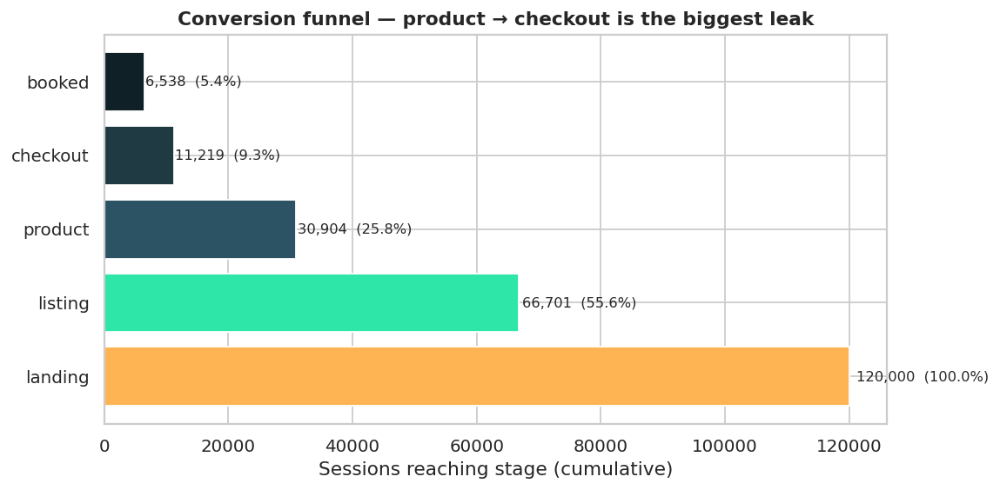
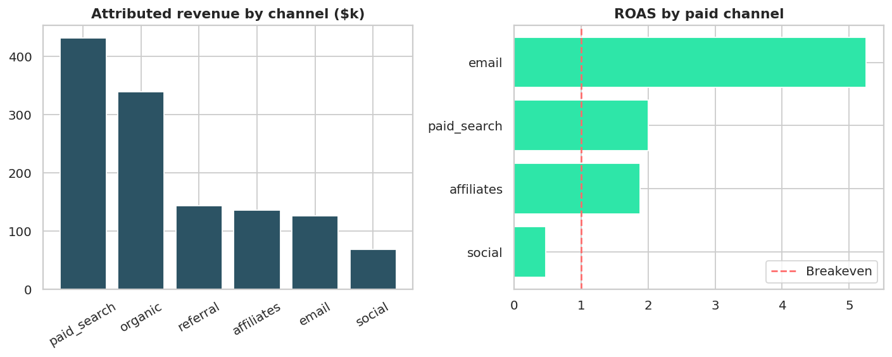
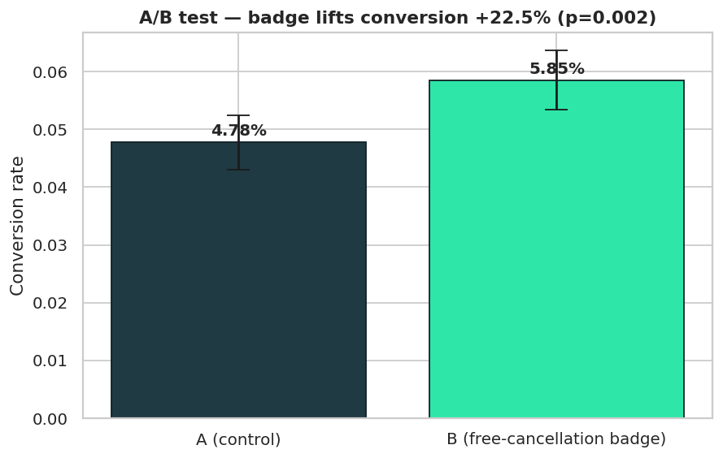
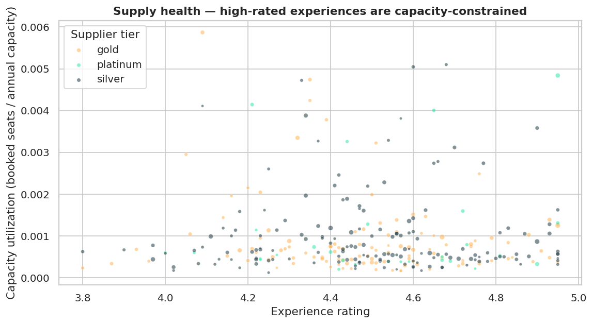
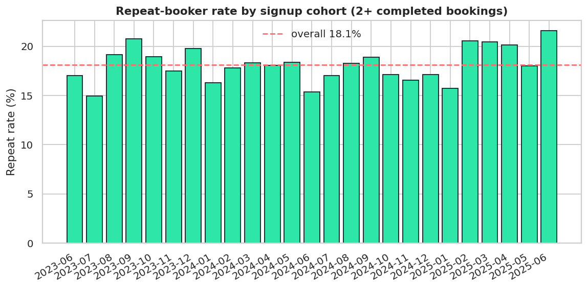
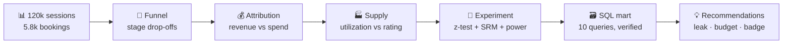

<div align="center">
  
</div>

<p align="center">
  
</p>

<p align="center">
  
  
  
  
  
</p>

> **Wanderly** is a fictional global marketplace for travel experiences — tours, attractions, day trips
> across 8 cities, 300 experiences, 60 suppliers, multiple currencies. This project runs the full
> marketplace analyst loop: **KPI reporting → conversion funnel → marketing attribution →
> supply-side economics → seasonality → A/B test readout → recommendations.**

*Why fictional? Portfolio projects should never borrow a real company's name — the methods transfer,
the brand doesn't.*

---

## 📊 The headline numbers

| Metric | Value |
|---|---|
| Sessions analyzed | 120,000 |
| Completed bookings | 5,785 |
| GMV | **$1,245,086** |
| Session → booking conversion | 5.45% |
| A/B test result | **+22.5% lift, p = 0.002 → ship it** |

---

## 🔍 Finding #1 — the product → checkout leak

Of every 100 sessions: 56 reach listings, 26 view a product, **9 start checkout**, 5 book.
The product → checkout step converts at just **36.3%** — the single biggest leak in the funnel,
and mobile (65% of traffic) converts below desktop.



## 💸 Finding #2 — social is underwater

| Channel | Revenue | Spend | ROAS |
|---|---|---|---|
| Email | $126k | $24k | **5.3x** |
| Paid search | $432k | $216k | 2.0x |
| Affiliates | $136k | $72k | 1.9x |
| Social | $69k | $144k | **0.5x** |

Every dollar into social returns fifty cents. Cutting social spend 50% and reallocating to email
and paid search saves ~$60k/year at equal bookings.



## 🧪 Finding #3 — the experiment that pays

Free-cancellation badge on the product page, n=8,000/arm, 28 days:

| | Control | Treatment |
|---|---|---|
| Conversion | 4.78% | **5.85%** |

Two-proportion z-test: **z = 3.03, p = 0.0024** — significant at 99%. At current traffic,
that's roughly +1,500 bookings/year.



## 🏭 Finding #4 — supply can't keep up with demand

High-rated experiences cluster at high capacity utilization — the marketplace is leaving
demand unfulfilled. Fix: expand capacity with top suppliers or introduce dynamic pricing
on constrained inventory.



## 🔬 Finding #5 — experiment rigor before the ship decision

A significant p-value means nothing if the randomization broke. Two checks run *before*
any ship call:

- **SRM check** (chi-square on the 50/50 allocation): χ² = 0.000 — allocation is clean, no mismatch.
- **Power sanity**: baseline 4.78%, n = 8,000/arm → MDE at 80% power is 0.94pp. Observed lift is
  +1.08pp — above the MDE, so the test was powered to detect exactly this effect.

## 🔁 Finding #6 — cohort retention

Repeat-booker rate by signup cohort shows whether the product earns a second purchase —
acquisition without retention is a leaky bucket.



## 📱 Finding #7 — the mobile leak, quantified

Crossing the funnel leak with device: of ~18k mobile sessions that viewed a product,
only 34.2% reached checkout vs. 39.9% on desktop — **11,987 mobile sessions** died at
that single step, the largest addressable pool of lost intent in the funnel.

---

## ⚙️ How it works



## 📁 Project structure

```
marketplace-analytics/
├── Wanderly_Marketplace_Analytics.ipynb   # THE analysis — 60 cells, fully executed
├── build_notebook.py                 # generates the .ipynb from ordered cells
├── run_notebook.py                   # executes the notebook (no kernel needed)
├── analysis.py                       # standalone script version of the charts
├── data/                             # sessions, bookings, experiences, suppliers, users, experiment, spend
├── sql/
│   ├── build_mart.py                 # builds wanderly.db (SQLite) from data/
│   ├── analysis_queries.sql          # 10 queries, basic → advanced (CTEs, window functions)
│   └── verify_sql.py                 # asserts SQL results == Python findings
├── visuals/                          # 14 charts (regenerated by the notebook)
├── findings.md                       # detailed write-up
├── kpi_summary.csv
└── requirements.txt
```

## ▶️ Reproduce

```bash
pip install -r requirements.txt
# The analysis: open Wanderly_Marketplace_Analytics.ipynb and run top to bottom.
# Data is already in data/. To rebuild the notebook file itself:
python build_notebook.py  # writes the .ipynb
python run_notebook.py    # executes it (embeds outputs)

# SQL layer
python sql/build_mart.py  # builds wanderly.db
python sql/verify_sql.py  # 20 checks: SQL results == Python findings
```

## 🎯 Skills demonstrated

**SQL** — complex joins, CTEs, window functions (LAG, RANK, running totals), conditional
aggregation, funnel math in SQL, cohort retention queries · **Experimentation** — A/B test
design, two-proportion z-test, SRM checks, power/MDE analysis, guardrail metrics ·
**Product analytics** — funnel analysis, conversion optimization, attribution & ROAS,
supply-side economics, cohort retention, KPI reporting & data storytelling ·
**Python** — pandas, matplotlib, seaborn, SQLite · deterministic synthetic data design
